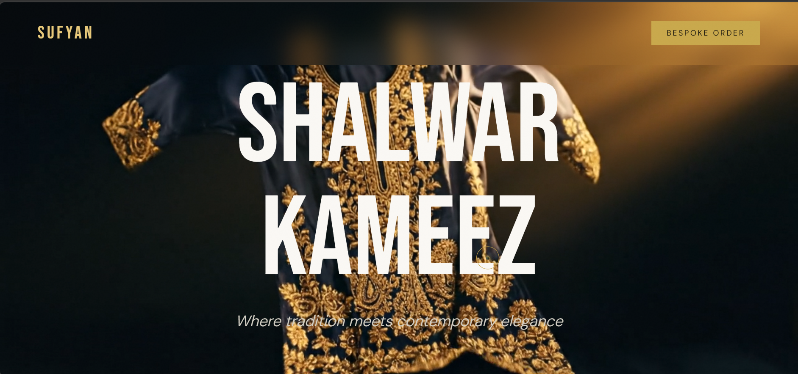
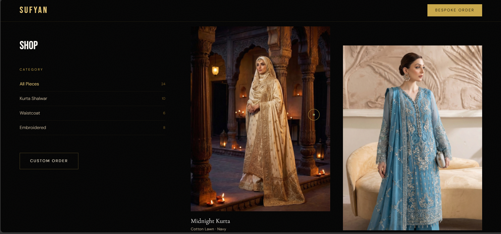
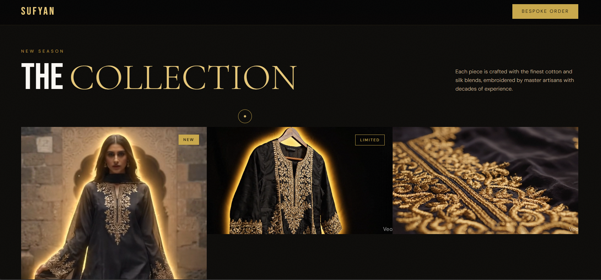
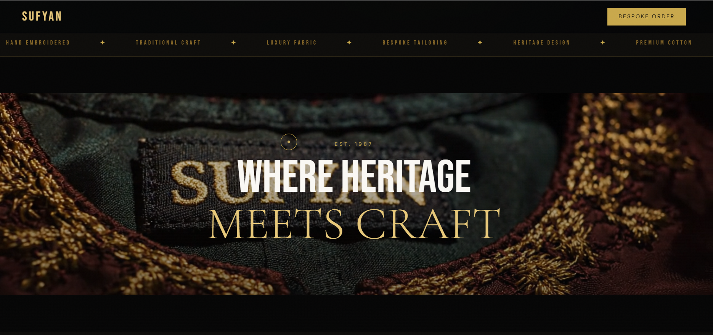
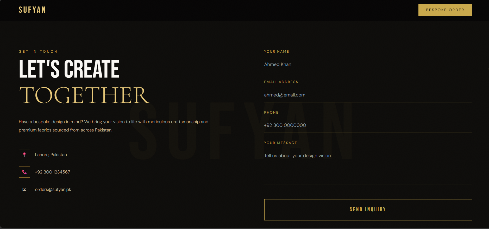

# SUFYAN
### *Where Tradition Meets Couture*

> An Awwwards-level brand website for a premium Shalwar Kameez label — built with React, GSAP, and Tailwind CSS.



---

## ✦ Live Preview

```
npm run dev → http://localhost:5173
```

---

## ✦ Screenshots

| | |
|---|---|
|  |  |
| *Cinematic hero with scroll-synced video* | *GSAP scroll-triggered reveals* |
|  |  |
| *Stats counter & parallax section* | *Hover-reveal product gallery* |


*Fully responsive across all devices*

---

## ✦ Tech Stack

| Tool | Version | Purpose |
|------|---------|---------|
| **React** | 18+ | Component architecture |
| **Vite** | 5+ | Lightning-fast dev server & bundler |
| **GSAP + ScrollTrigger** | 3+ | All scroll & entrance animations |
| **@gsap/react** | latest | `useGSAP` hook for React-safe animations |
| **Tailwind CSS** | 3+ | Utility-first styling |

---

## ✦ Project Structure

```
sufyan-shalwar/
│
├── public/
│   ├── favicon.svg
│   └── icons.svg
│
├── src/
│   ├── assets/
│   │   ├── images/
│   │   │   ├── gallery/          ← floral-embroidery, stone-setting, zari-work
│   │   │   └── products/         ← all product images
│   │   └── videos/               ← hero.mp4, brand-reveal.mp4, etc.
│   │
│   ├── components/
│   │   ├── Cursor.jsx            — Custom trailing cursor
│   │   ├── Navbar.jsx            — Fixed nav, fades in on scroll
│   │   ├── Hero.jsx              — Timeline entrance + scroll-synced video
│   │   ├── Marquee.jsx           — Infinite scrolling ticker
│   │   ├── Collection.jsx        — Product grid with hover reveals
│   │   ├── About.jsx             — Stats counter + parallax
│   │   ├── Art.jsx               — Mask reveal + horizontal parallax
│   │   ├── Menu.jsx              — Filterable catalog grid
│   │   └── Contact.jsx           — Staggered contact form
│   │
│   ├── styles/
│   ├── App.jsx                   — Assembles all sections
│   ├── App.css
│   ├── index.css                 — Tailwind + global styles
│   └── main.jsx                  — React entry point
│
├── screenshots/                  ← README preview images
├── index.html
├── tailwind.config.js
├── vite.config.js
├── postcss.config.js
└── package.json
```

---

## ✦ Getting Started

### Prerequisites
- Node.js `v18+`
- npm `v9+`

### Installation

```bash
# 1. Clone the repository
git clone https://github.com/krishsofttech-dev/SUFYAN-Website.git

# 2. Navigate into the project
cd sufyan-shalwar

# 3. Install dependencies
npm install

# 4. Start the dev server
npm run dev
```

Open your browser at **http://localhost:5173**

---

## ✦ Build for Production

```bash
npm run build
```

The compiled output lands in the `dist/` folder. Deploy it in one click:

[](https://vercel.com)

---

## ✦ Adding Your Hero Video

1. Place your video at: `src/assets/videos/hero.mp4`
2. Open `src/components/Hero.jsx`
3. On the `<video>` tag:
   - **Add** → `src="/src/assets/videos/hero.mp4"`
   - **Remove** → `style={{ display: 'none' }}`

The video will automatically sync its playback position with your scroll depth via GSAP ScrollTrigger.

---

## ✦ Adding Real Product Images

Replace the placeholder fabric CSS blocks in each component with:

```jsx

```

---

## ✦ Component Guide

| Component | Animation | Description |
|-----------|-----------|-------------|
| `Cursor` | GSAP lerp | Smooth trailing dot cursor |
| `Navbar` | Fade + blur | Glassmorphism nav on scroll |
| `Hero` | Timeline + scrub | Full-screen cinematic entrance |
| `Marquee` | Infinite loop | Brand tagline ticker |
| `Collection` | Stagger reveal | Product cards with hover zoom |
| `About` | Counter + parallax | Animated brand stats |
| `Art` | Clip-path mask | Craftmanship gallery reveal |
| `Menu` | Filter + fade | Full catalog with category tabs |
| `Contact` | Stagger form | Animated contact section |

---

<p align="center">
 <br> Designed and built by krishsofttech-dev <br>
  Crafted with care — <em>SUFYAN © 2026</em>
</p>
